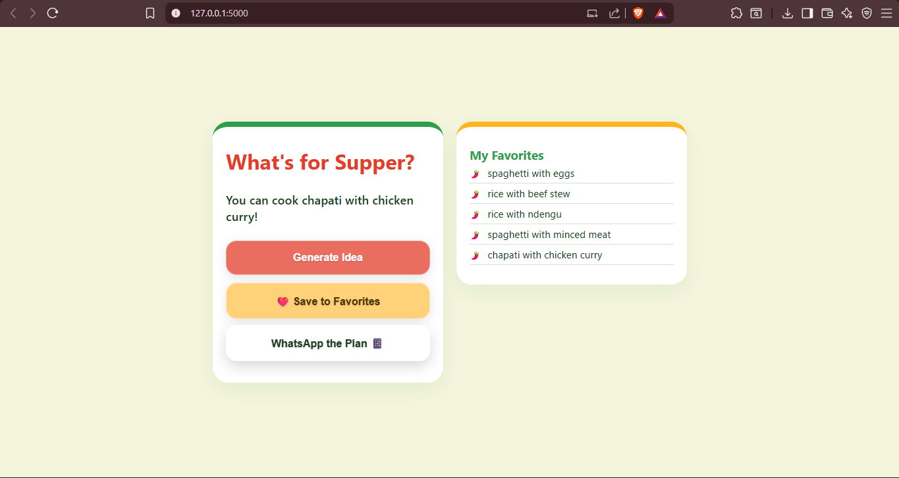

# 🌶️ Kenya Cooks (Meal Generator)



A lightweight **Progressive Web App (PWA)** designed to solve the daily "What should we cook for supper?" dilemma in a Kenyan household. 

Featuring a grounded, earthy green and brown aesthetic, it suggests popular local meal combinations like Ugali & Nyama, Rice & Ndengu, and more.

## ✨ Features
* **Meal Generator:** Instant supper ideas based on Kenyan favorites.
* **Favorites List:** Save your favorite combinations locally on your device.
* **WhatsApp Integration:** Share the dinner plan directly with family or roommates.
* **PWA Ready:** Install it on your Android or iOS home screen and use it like a native app.
* **Responsive Design:** Works perfectly on mobile, tablet, and desktop.

## 🎨 Visual Identity
The app uses a "Farm-to-Table" color palette:
* **Kenyan Green (`#2D5A27`):** Representing fresh Sukuma Wiki and lush agriculture.
* **Earth Brown (`#5D4037`):** Inspired by the rich soil and traditional earthenware (Sufuria/Nyungu).
* **Warm Beige:** A soft background for easy reading in the kitchen.

## 🛠️ Tech Stack
* **Backend:** Python (Flask)
* **Frontend:** HTML5, CSS3 (Flexbox), JavaScript (Vanilla)
* **Storage:** Browser LocalStorage (for favorites)
* **PWA:** Web Manifest & Service Workers

## 🚀 Getting Started

### Prerequisites
* Python 3.x
* Pip

### Installation
1. **Clone the repository:**
   ```bash
   git clone [https://github.com/yourusername/kenya-cooks.git](https://github.com/yourusername/kenya-cooks.git)
   cd kenya_cooks
   ```

2. **Install dependencies:**
   ```bash
   pip install flask
   ```

3. **Run the app:**
   ```bash
   python app.py
   ```
4. **Access the app:**
   Open `http://127.0.0.1:5000` in your browser.

## 📱 How to Install (PWA)
1. Deploy the app to a hosting service with HTTPS (e.g., Render, Vercel, or PythonAnywhere).
2. Open the URL on your mobile browser (Chrome for Android, Safari for iOS).
3. Select **"Add to Home Screen"** from the browser menu.
4. The icon will now appear on your phone's app drawer!

## 📂 Project Structure
```text
kenya_cooks/
├── app.py              # Flask backend & meal logic
├── static/
│   ├── manifest.json   # PWA configuration
│   ├── sw.js           # Service worker for offline support
│   └── icons/          # App icons
└── templates/
    └── index.html      # Single-page frontend
```

## 📜 License
MIT
```

---

### Pro-Tip for your GitHub:
If you want to make this README look even better on GitHub, you can add the screenshot you shared with me earlier. Just upload the image to a folder called `assets` and add this line under the title:

``

You've turned a simple `random.choice` script into a full-blown app. What’s the next feature on your roadmap—maybe a grocery list generator based on the selected meal?